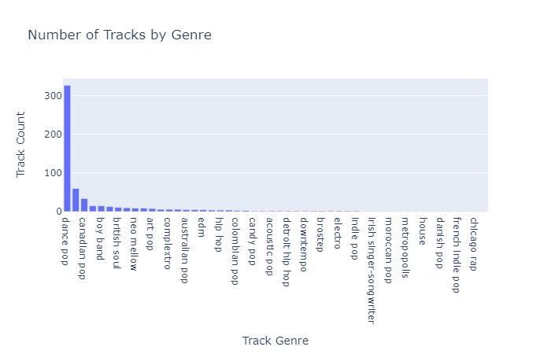
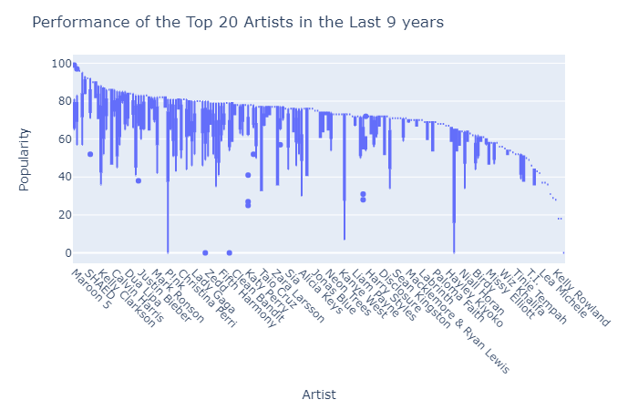
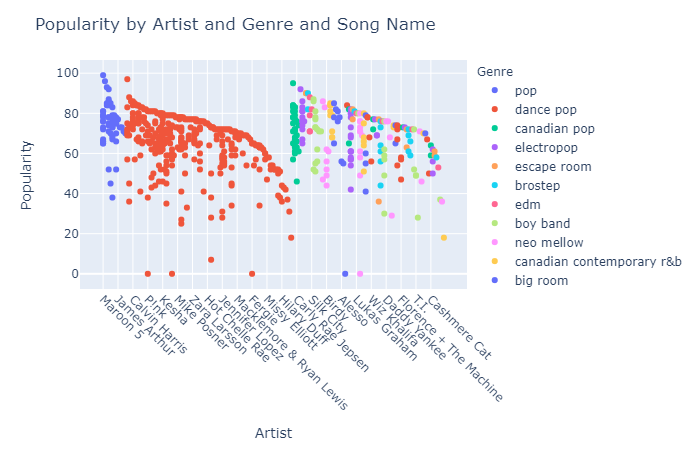
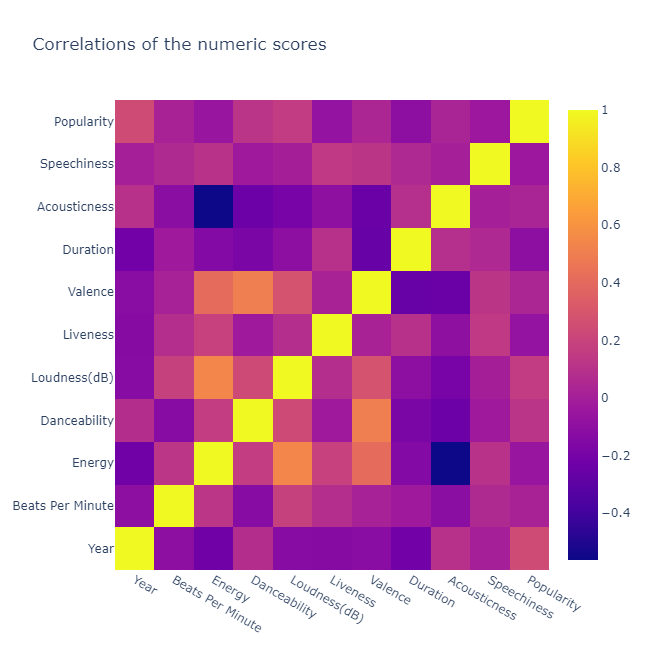

# Spotify Top Charts EDA and Song Recommendation System

<h3>In statistics, exploratory data analysis is an approach to analyzing data sets  to summarize their main characteristics,often with visual methods.  A statistical model can be used or not, but primarily EDA is for seeing  what the data can tell us beyond the formal modeling or hypothesis testing task.</h3>

### It was observed that including the name of the artist in the feature vector significantly impacted the recommendations by favouring songs from the same artist more than any other feature. Hence, two pynb files differ only by this feature vector. Both these notebooks could have been merged into one by simply creating a conditional.

### Although the Spotify's algorithm is way more complex by considering massive database and user history and habits, this recommender work quite well and I personally found the suggestions quite apt :-)
